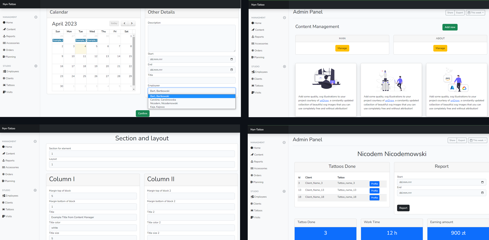
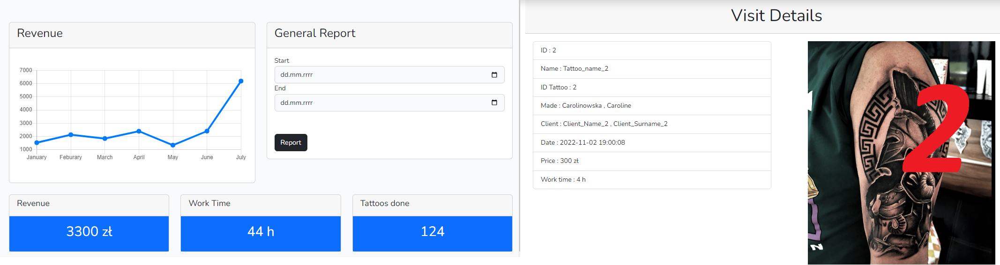
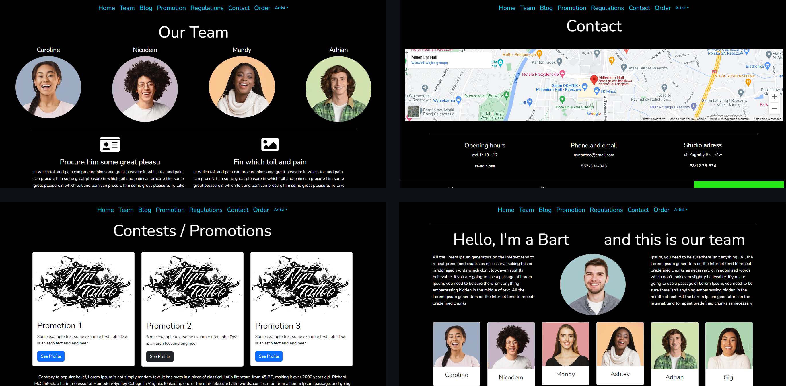
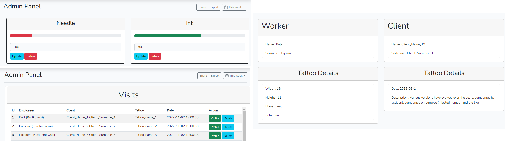

### Description

An application dedicated to the enterprise. A tool that enables process management
in company.

</img>

The admin panel has the following functionalities:
- managing the content of subpages, with the choice of the appearance of elements
(column layout, margin, padding, color etc)
- management of customer requests
- generating reports from a selected period
- management of future planning, visits
- accessories management (automatic update after approval of the visit)
- full management of models (Client, Employee, Tattoo)
- the ability to view history, add photos for specific visits

</img>

A website with a series of information subpages about the team, promotion,
blog articles, terms and conditions, contact information and a gallery of artists' work.
Few CSS/JS for the effect, colorful loader, delay effect of appearing elements,
hovery, an animated gallery.

</img>

### How to use

- Clone the repository with __git clone__
- Copy __.env.example__ file to __.env__ and edit database credentials there
- Run __composer install__
- Run __php artisan key:generate__
- Run __php artisan migrate__
- Run __php artisan db:seed --class=AppSeeder__ 
- That's it
- I didn't add middleware, you can access the panel with the url '/admin'
---

</img>